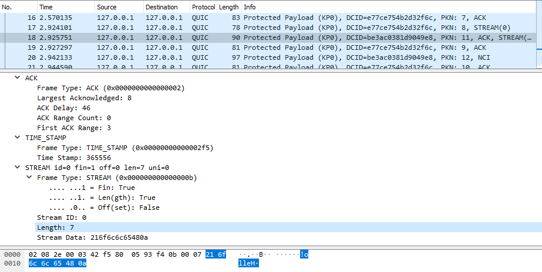

% Programming LSQUIC
% Dmitri Tikhonov / LiteSpeed Technologies
% Netdev 0x14

# Presentation outline
- Introduction
- LSQUIC history, features, and architecture
- Using API
  - Objects: engines, connections, streams
  - Sending and receiving packets
  - Instantiation and callbacks
- Bonus section, time permitting

# Example Program: tut.c
- You can follow along
- Snippets of `tut.c` are used as examples
- Compile the code while I talk about architecture

```bash
git clone https://github.com/litespeedtech/lsquic-tutorial
# This pulls in LSQUIC and BoringSSL
git submodule update --init --recursive
# Tested on Ubuntu
cmake .
make
```

# What is QUIC (keep it short)
- Why: Ossification
- Began as HTTP/2 over UDP
- Who: First Google, now everyone:
  - LiteSpeed Technologies, Microsoft, Apple, Facebook, Akamai, and others
- General-purpose transport protocol
- Killer feature: HTTP/3 (end of 2020)
- Experimental: datagrams, multipath, DNS-over-QUIC, NETCONF-over-QUIC,
  and so on
- Future: bright

# Which QUIC do you mean?
- Google QUIC vs IETF QUIC
- gQUIC? iQUIC? We all QUIC for yogurt?
- Google QUIC is on the way out
- In the slides that follow, "QUIC" means "IETF QUIC"

# Introducing LSQUIC
- Began as proprietary, then open-sourced
- Vanilla C
- Minimal dependencies
- Performance: minimize buffering, memory, CPU cycles
- Robustness: mitigate protocol attacks
- Flexibility: TIMTOWTDI, from callback dispatch to event loop
- Portability: Linux, FreeBSD, MacOS, Windows, Android, Raspberry Pi

# History
- *2016*. Goal: add Google QUIC support to LiteSpeed Web Server.
- *2017*. gQUIC support is shipped (Q035); LSQUIC is released on GitHub (client only).
- *2018*. IETF QUIC work begins. LSQUIC is the first functional HTTP/3 server.
- *2019*. LSQUIC 2.0 is released on GitHub (including the server bits). HTTP/3 support is shipped.
- *2020*. QUIC and HTTP/3 are new RFCs. (One can hope.)

# Features
- Latest (Draft-27, Draft-28, and Draft-29) IETF QUIC and HTTP/3
  support, including
  - ECN, spin bits, path migration, NAT rebinding
  - DPLPMTUD
  - Push promises, key updates
  - Several experimental extensions:
    - loss bits
    - timestamps
    - delayed ACKs
    - QUIC grease bit
- Google QUIC versions Q043, Q046, and Q050 (what Chrome currently uses)
- Many, many knobs to play with

# Architecture
- Does not use sockets
  - bring your own networking via callbacks
- Bring your own event loop
  - or none at all
- Bring your own TLS context
- Scalable connection management in priority queues:
  - ordered by next event time
  - ready connections ordered by last tick time

# Objects
- Engine
  - Connection management, packet scheduling
  - Client mode *or* server mode
  - HTTP mode
- Connection
  - Created, managed, and destroyed by engine
  - Client initiates connection; object created before handshake is successful.
  - Server: by the time user code gets the connection object, the handshake has already been completed
  - Can have many streams during lifetime
- Stream
  - Belongs to a connection
  - Bidirectional
  - Usually corresponds to request/response exchange -- depending on
    the application protocol

# HTTP mode
- Single library for both QUIC and HTTP/3
- Hide HTTP logic: control streams, header compression, framing
- Identical interface for gQUIC and HTTP/3
- Historical or strategic?
- Optimization: write-through

# Include files

```c
  #include "lsquic.h"
```

- This single include file contains all the necessary LSQUIC declarations.
- It pulls in auxiliary `lsquic_types.h`.

# Library initialization

```c
  /* Example from tut.c */
  if (0 != lsquic_global_init(LSQUIC_GLOBAL_SERVER
                            | LSQUIC_GLOBAL_CLIENT))
  {
      fprintf(stderr, "global initialization failed\n");
      exit(EXIT_FAILURE);
  }
```

Before the first engine object is instantiated, the library must be
initialized.

This call will initialize the crypto library, gQUIC server certificate
cache, and, depending on the platform, monotonic timers.

If you plan to instantiate engines only in a single mode, client or server,
you can omit the appropriate flag.

# Introducing tut.c

- Program to illustrate LSQUIC API use
- Contains both client and server code
- Echo service: client sends a line of text to server, the
  server returns the line, reversed
- Several examples that follow are excerpts from `tut.c`

# Running tutorial program

- Peruse online help: use the `-h` flag
- Running client or server: the server takes `-c` and `-k` arguments

```
# Server:
sh$ ./tut -c mycert-cert.pem -k mycert-key.pem ::0 12345

# Client:
sh$ ./tut ::1 12345 -L debug -f client.log
Hello!
!olleH
^D
```

# Engine constructor
- Server or client
- HTTP mode
```c
  /* Return a new engine instance.
   * `flags' is bitmask of LSENG_SERVER and LSENG_HTTP.
   * `api' is required.
   */
  lsquic_engine_t *
  lsquic_engine_new (unsigned flags,
                     const struct lsquic_engine_api *api);
```

# Specifying engine callbacks
- Pass pointer to ``struct lsquic_engine_api``
```c
  /* Minimal configuration */
  struct lsquic_engine_api engine_api = {
    .ea_packets_out     = send_packets_out,
    .ea_packets_out_ctx = sender_ctx,
    .ea_stream_if       = &stream_callbacks,
    .ea_stream_if_ctx   = &some_context,
    .ea_get_ssl_ctx     = get_ssl_ctx,  /* Server only */
  };
```

# Excerpt from tut.c
```c
  /* Initialize callbacks */
  memset(&eapi, 0, sizeof(eapi));
  eapi.ea_packets_out = tut_packets_out;
  eapi.ea_packets_out_ctx = &tut;
  eapi.ea_stream_if   = tut.tut_flags & TUT_SERVER
              ? &tut_server_callbacks : &tut_client_callbacks;
  eapi.ea_stream_if_ctx = &tut;
  eapi.ea_get_ssl_ctx   = tut_get_ssl_ctx;
```

# Packets in
- Single function to feed packets to engine instance
- Specify: datagram, peer and local addresses, ECN value
- ``peer_ctx`` is associated with peer address: it is passed to
  send packets function.

```c
  /*  0: processed by real connection
   *  1: handled
   * -1: error: invalid arguments, malloc failure
   */
  int
  lsquic_engine_packet_in (lsquic_engine_t *,
      const unsigned char *udp_payload, size_t sz,
      const struct sockaddr *sa_local,
      const struct sockaddr *sa_peer,
      void *peer_ctx, int ecn);
```

# Why specify local address
- Becomes source address on outgoing packets
  - Important in multihomed configuration
- Path change detection
  - QUIC sends special frames to validate path

# Packets out
- Callback
- Called during connection processing (explicit call by user)

```c
  /* Returns number of packets successfully sent out or -1 on error.
   *
   * If not all packets could be sent, call
   * lsquic_engine_send_unsent_packets() when can send again.
   */
  typedef int (*lsquic_packets_out_f)(
      void                          *packets_out_ctx,
      const struct lsquic_out_spec  *out_spec,
      unsigned                       n_packets_out
  );
```

# When an error occurs
- `errno` is examined
- `EAGAIN` (or `EWOULDBLOCK`) means retry later; engine enters the
  "can't send packets" mode
- Call ``lsquic_engine_send_unsent_packets()`` when sending is
  possible again
- `EMSGSIZE` means the packet is too large.  This happens when MTU
  probes are sent.  The engine retries sending without the offending
  packet.
- Other `errno` values cause immediate termination of corresponding
  connection.

# Outgoing packet specification

```c
  struct lsquic_out_spec
  {
      struct iovec          *iov;
      size_t                 iovlen;
      const struct sockaddr *local_sa;
      const struct sockaddr *dest_sa;
      void                  *peer_ctx;
      int                    ecn; /* 0 - 3; see RFC 3168 */
  };
```

- Why ``iovec``?
  - UDP datagram can contain more than one QUIC packet
  - Packet coalescing

# Packets out example
```c
  static int
  my_packets_out (void *ctx, const struct lsquic_out_spec *specs,
                                              unsigned n_specs) {
      struct msghdr msg;  memset(&msg, 0, sizeof(msg));
      unsigned n;
      for (n = 0; n < n_specs; ++n) {
          msg.msg_name       = (void *) specs[n].dest_sa;
          msg.msg_namelen    = sizeof(struct sockaddr_in);
          msg.msg_iov        = specs[n].iov;
          msg.msg_iovlen     = specs[n].iovlen;
          if (sendmsg((int) specs[n].peer_ctx, &msg, 0) < 0)
              break;
      }
      return (int) n;
  }
```

# When to process connections

```c
  /* Returns true if there are connections to be processed, in
   * which case `diff' is set to microseconds from current time.
   */
  int
  lsquic_engine_earliest_adv_tick (lsquic_engine_t *, int *diff);
```

- Connections are either tickable immediately or at some future point
- Future point may be a retransmission, idle, or some other alarm
- Only exception when idle timeout is disabled (on by default)
- Engine knows when to process connections next

# Example with event loop
```c
/* Abbreviated, see full version in tut.c */
void tut_process_conns (struct tut *tut) {
    ev_tstamp timeout;
    int diff;
    ev_timer_stop();
    lsquic_engine_process_conns(engine);
    if (lsquic_engine_earliest_adv_tick(engine, &diff) {
        if (diff > 0)
            timeout = (ev_tstamp) diff / 1000000;   /* To seconds */
        else
            timeout = 0.;
        ev_timer_init(timeout)
        ev_timer_start();
    }
}
```

# Tickable connection
- There are incoming packets
- A stream is both readable by the user code and the user code wants
  to read from it
- A stream is both writeable by the user code and the user code wants
  to write to it
- User has written to stream outside of ``on_write()`` callbacks (that
  is allowed) and now there are packets ready to be sent
- A control frame needs to be sent out
- A stream needs to be serviced or created

# Processing connections
- To process connections, call `lsquic_engine_process_conns()`
- This calls necessary callbacks to read from and write to streams
  and send packets out
- Do not call `lsquic_engine_process_conns()` from inside callbacks:
  it is not reentrant.
- Call `lsquic_engine_process_conns()` when advised by
  `lsquic_engine_earliest_adv_tick()`
- Another function that sends packets is `lsquic_engine_send_unsent_packets()`
  - Call it if there was a previous failure to send out all packets

# Engine callbacks
- Required
  - Callback to send packets
  - Connection and stream callbacks
    - ``on_new_conn()``, ``on_read()``, and so on
  - Callback to get default TLS context (server only)
- Optional
  - Certificate lookup by SNI (server only)
  - Outgoing packet memory allocation
  - Connection ID lifecycle: new, live, and old CIDs
  - Shared memory hash
  - HTTP header set processing

# Stream and connection callbacks
- Specified in ``struct lsquic_stream_if``
- Mandatory callbacks:
  - ``on_new_conn()`` - new connection is created
  - ``on_conn_closed()``
  - ``on_new_stream()``
  - ``on_read()``
  - ``on_write()``
  - ``on_close()``
- Optional callbacks:
  - ``on_goaway_received()``
  - ``on_new_token()`` (client only)
  - ``on_hsk_done()`` (client only)
  - ``on_sess_resume_info()`` (client only)

# On new connection
- Server: handshake successful; client: object created
- Chance to create custom per-connection context
```c
  /* Return pointer to per-connection context.  OK to return NULL. */
  static lsquic_conn_ctx_t *
  my_on_new_conn (void *ea_stream_if_ctx, lsquic_conn_t *conn)
  {
      struct some_context *ctx = ea_stream_if_ctx;
      struct my_conn_ctx *my_ctx = my_ctx_new(ctx);
      if (ctx->is_client)
          /* Need a stream to send request */
          lsquic_conn_make_stream(conn);
      return (void *) my_ctx;
  }
```

# On new stream
- Depending on situation, register interest in reading or writing
  - Or just read or write
- Chance to create per-stream context
```c
  /* Return pointer to per-connection context.  OK to return NULL. */
  static lsquic_stream_ctx_t *
  my_on_new_stream (void *ea_stream_if_ctx, lsquic_stream_t *stream) {
      struct some_context *ctx = ea_stream_if_ctx;
      /* Associate some data with this stream: */
      struct my_stream_ctx *stream_ctx
                    = my_stream_ctx_new(ea_stream_if_ctx);
      stream_ctx->stream = stream;
      if (ctx->is_client)
          lsquic_stream_wantwrite(stream, 1);
      return (void *) stream_ctx;
  }
```

# On read
- Read data -- or collect error
```c
  static void
  my_on_read (lsquic_stream_t *stream, lsquic_stream_ctx_t *h) {
      struct my_stream_ctx *my_stream_ctx = (void *) h;
      unsigned char buf[BUFSZ];

      ssize_t nr = lsquic_stream_read(stream, buf, sizeof(buf));
      /* Do something with the data.... */
      if (nr == 0) /* EOF */ {
          lsquic_stream_shutdown(stream, 0);
          lsquic_stream_wantwrite(stream, 1); /* Want to reply */
      }
  }
```

# On write
```c
  static void
  my_on_write (lsquic_stream_t *stream, lsquic_stream_ctx_t *h) {
      struct my_stream_ctx *my_stream_ctx = (void *) h;
      ssize_t nw = lsquic_stream_write(stream,
          my_stream_ctx->resp, my_stream_ctx->resp_sz);
      if (nw == my_stream_ctx->resp_sz)
          lsquic_stream_close(stream);
  }
```

- If called, you should be able to write *some* bytes
- Is not called unless `lsquic_stream_wantwrite(stream, 1)` is called first

# On stream close
- After this, stream will be destroyed, drop all pointers to it
```c
  /* Made-up example */
  static void
  my_on_close (lsquic_stream_t *stream, lsquic_stream_ctx_t *h) {
      lsquic_conn_t *conn = lsquic_stream_conn(stream);
      struct my_conn_ctx *my_ctx = lsquic_conn_get_ctx(conn);
      if (!has_more_reqs_to_send(my_ctx)) /* For example */
          lsquic_conn_close(conn);
      free(h);
  }
```

# On stream close in tut.c
```c
  static void
  tut_server_on_close (lsquic_stream_t *stream,
                                        lsquic_stream_ctx_t *h)
  {
    struct tut_server_stream_ctx *const tssc = (void *) h;
    free(tssc);
    LOG("stream closed");
  }
```

# On connection close
- After this, connection will be destroyed, drop all pointers to it
```c
  static void
  my_on_conn_closed (lsquic_conn_t *conn) {
      struct my_conn_ctx *my_ctx = lsquic_conn_get_ctx(conn);
      struct some_context *ctx = my_ctx->some_context;

      --ctx->n_conns;
      if (0 == ctx->n_conn && (ctx->flags & CLOSING))
          exit_event_loop(ctx);

      free(my_ctx);
  }
```

# On connection close in tut.c
- This deletes last event from the event loop -- the event loop
  exits and the program terminates
- Note that the same thing happens if handshake fails
```c
  static void
  tut_client_on_conn_closed (struct lsquic_conn *conn)
  {
    struct tut *const tut = (void *) lsquic_conn_get_ctx(conn);

    LOG("client connection closed -- stop reading from socket");
    ev_io_stop(tut->tut_loop, &tut->tut_sock_w);
  }
```

# More about streams
- When writing to a stream, data is placed directly into packets
  - Except when it isn't
- Writes smaller than packet size are buffered
- Inside `on_read` and `on_write` callbacks, reading and writing succeeds
- "On read" and "on write" callbacks are called in a loop
  - Don't forget to stop reading or writing
  - Make progress
  - Circuit breaker to save you
- Unless stream is reset, in which case reading from stream returns -1
  - This is done so that user can collect error

# More stream functions
```c
  /* Flush any buffered data.  This triggers packetizing even a single
   * byte into a separate frame.
   */
  int
  lsquic_stream_flush (lsquic_stream_t *);

  /* Possible values for how are 0, 1, and 2.  See shutdown(2). */
  int
  lsquic_stream_shutdown (lsquic_stream_t *, int how);

  int
  lsquic_stream_close (lsquic_stream_t *);
```

# Stream return values and error codes
- Reading and writing interface modeled on `read(2)` and `write(2)`
- Including the use of `errno`
  - If no data to read, error is `EWOULDBLOCK`
  - If stream is closed, error is `EBADF`
  - If stream is reset, error is `ECONNRESET`
  - After this, error codes fit only if you squint very hard
    - `EINVAL` - argument to `shutdown` is not 0, 1, or 2
    - `EILSEQ` - cannot send HTTP payload before headers
    - `EBADMSG` - sending HTTP headers is not allowed (several reasons)
- When `lsquic_stream_read()` returns 0, it means EOF
- `lsquic_stream_write()` returns 0 when flow control or congestion
  control limit is reached.

# More ways to read and write
- Scatter/gather
- Similar to `readv(2)` and `writev(2)`
```c
  ssize_t
  lsquic_stream_readv (lsquic_stream_t *, const struct iovec *,
                                                    int iovcnt);
  ssize_t
  lsquic_stream_writev (lsquic_stream_t *, const struct iovec *,
                                                        int count);
```

# Read using a callback
- Use for zero-copy stream processing
- `lsquic_stream_read()` and `lsquic_stream_readv()` are just
  wrappers
- Callback returns number of bytes processed
  - Pointer to user-supplied context;
  - Pointer to the data;
  - Data size (can be zero); and
  - Indicator whether the FIN follows the data.
- If callback returns 0 or value smaller than `len`, reading
  stops
```c
  ssize_t
  lsquic_stream_readf (lsquic_stream_t *,
    size_t (*readf)(void *ctx, const unsigned char *, size_t len, int fin),
    void *ctx);
```

# Stream read: copy data
```c
  static void   /* v0 is the default.  On command line: -b 0 */
  tut_client_on_read_v0 (lsquic_stream_t *stream, lsquic_stream_ctx_t *h)
  {
    struct tut *tut = (struct tut *) h;
    unsigned char buf[3];
    ssize_t nread = lsquic_stream_read(stream, buf, sizeof(buf));
    if (nread > 0)
    {
        fwrite(buf, 1, nread, stdout);
        fflush(stdout);
    }
  /* --- 8< --- snip --- 8< --- */
  }
```
- The classic way to read
- Easy, but it copies data

# Stream read take 2: use callback
```c
  static void   /* On command line: -b 1 */
  tut_client_on_read_v1 (lsquic_stream_t *stream, lsquic_stream_ctx_t *h)
  {
    struct tut *tut = (struct tut *) h;
    size_t nread = lsquic_stream_readf(stream, tut_client_readf_v1, NULL);
    if (nread == 0)
    {
        LOG("read to end-of-stream: close and read from stdin again");
        lsquic_stream_shutdown(stream, 0);
        ev_io_start(tut->tut_loop, &tut->tut_u.c.stdin_w);
    }
  /* --- 8< --- snip --- 8< --- */
  }
```

# Stream read take 2: the callback itself
```c
  static size_t
  tut_client_readf_v1 (void *ctx, const unsigned char *data,
                                                    size_t len, int fin)
  {
      if (len)
      {
          fwrite(data, 1, len, stdout);
          fflush(stdout);
      }
      return len;
  }

```

- `len` may be arbitrary (and larger than packet size)
- Return value smaller than `len` to stop callback

# Stream read take 3: use FIN
```c
  struct client_read_v2_ctx { struct tut *tut; lsquic_stream_t *stream; };
  
  static void   /* On command line: -b 2 */
  tut_client_on_read_v2 (lsquic_stream_t *stream,
                                              lsquic_stream_ctx_t *h) {
    struct tut *tut = (struct tut *) h;
    struct client_read_v2_ctx v2ctx = { tut, stream, };
    ssize_t nread = lsquic_stream_readf(stream, tut_client_readf_v2,
                                                                &v2ctx);
    if (nread < 0)
      /* ERROR */
  }
```
- Save one `on_read()` call

# Stream read take 3: the callback itself
```c
  static size_t
  tut_client_readf_v2 (void *ctx, const unsigned char *data,
                                                size_t len, int fin) {
    struct client_read_v2_ctx *v2ctx = ctx;
    if (len)
      fwrite(data, 1, len, stdout);
    if (fin)
    {
      fflush(stdout);
      LOG("read to end-of-stream: close and read from stdin again");
      lsquic_stream_shutdown(v2ctx->stream, 0);
      ev_io_start(v2ctx->tut->tut_loop, &v2ctx->tut->tut_u.c.stdin_w);
    }
    return len;
  }
```

# Stream write take 1
```c
  static void   /* v0 is the default.  On command line: -w 0 */
  tut_server_on_write_v0 (lsquic_stream_t *stream, lsquic_stream_ctx_t *h)
  {
    struct tut_server_stream_ctx *const tssc = (void *) h;
    ssize_t nw = lsquic_stream_write(stream,
        tssc->tssc_buf + tssc->tssc_off, tssc->tssc_sz - tssc->tssc_off);
    if (nw > 0)
    {
        tssc->tssc_off += nw;
        if (tssc->tssc_off == tssc->tssc_sz)
            lsquic_stream_close(stream);
  /* --- 8< --- snip --- 8< --- */
  }
```

# Write using callbacks
```c
  struct lsquic_reader {
    /* Return number of bytes written to buf */
    size_t (*lsqr_read) (void *lsqr_ctx, void *buf, size_t count);
    /* Return number of bytes remaining in the reader.  */
    size_t (*lsqr_size) (void *lsqr_ctx);
    void    *lsqr_ctx;
  };

  /* Return umber of bytes written or -1 on error. */
  ssize_t
  lsquic_stream_writef (lsquic_stream_t *, struct lsquic_reader *);
```

# Stream write take 2
```c
  static void   /* On command line: -w 1 */
  tut_server_on_write_v1 (lsquic_stream_t *stream, lsquic_stream_ctx_t *h)
  {
      struct tut_server_stream_ctx *const tssc = (void *) h;
      struct lsquic_reader reader = { tssc_read, tssc_size, tssc, };
      ssize_t nw = lsquic_stream_writef(stream, &reader);
      if (nw > 0 && tssc->tssc_off == tssc->tssc_sz)
          lsquic_stream_close(stream);
  /* --- 8< --- snip --- 8< --- */
  }
```

- Useful when reading from external data source, such as file descriptor
- Write data directly into stream frame

# Reader size callback
- Return number of bytes remaining
```c
  static size_t
  tssc_size (void *ctx)
  {
    struct tut_server_stream_ctx *tssc = ctx;
    return tssc->tssc_sz - tssc->tssc_off;
  }
```

# Reader read callback
```c
  static size_t
  tssc_read (void *ctx, void *buf, size_t count)
  {
    struct tut_server_stream_ctx *tssc = ctx;

    if (count > tssc->tssc_sz - tssc->tssc_off)
      count = tssc->tssc_sz - tssc->tssc_off;
    memcpy(buf, tssc->tssc_buf + tssc->tssc_off, count);
    tssc->tssc_off += count;
    return count;
  }
```

- `count` is calculated using `tssc_size()`
- If larger than amount of remaining data, may indicate truncation

# Client: making connection
```c
  lsquic_conn_t *
  lsquic_engine_connect (lsquic_engine_t *,
        enum lsquic_version, /* Set to N_LSQVER for default */
        const struct sockaddr *local_sa,
        const struct sockaddr *peer_sa,
        void *peer_ctx,
        lsquic_conn_ctx_t *conn_ctx,
        const char *hostname,         /* Used for SNI */
        unsigned short base_plpmtu, /* 0 means default */
        const unsigned char *sess_resume, size_t sess_resume_len,
        const unsigned char *token, size_t token_sz);
```

# Specifying QUIC version
- There is no version negotiation version in QUIC... yet
- When passed to ``lsquic_engine_connect``, ``N_LSQVER`` means "let
  the engine pick the version"
  - The engine picks the highest it supports, so that's a good
    way to go

```c
  enum lsquic_version {
      LSQVER_043, LSQVER_046, LSQVER_050,     /* Google QUIC */
      LSQVER_ID27, LSQVER_ID28, LSQVER_ID29,  /* IETF QUIC */
      /* ...some special entries skipped */
      N_LSQVER    /* <====================== Special value */
  };

  /* This allows list of versions to be specified as bitmask: */
  es_versions = (1 << LSQVER_ID28) | (1 << LSQVER_ID29);
```

# Excerpt from tut.c
```c
    tut.tut_u.c.conn = lsquic_engine_connect(
        tut.tut_engine, N_LSQVER,
        (struct sockaddr *) &tut.tut_local_sas, &addr.sa,
        (void *) (uintptr_t) tut.tut_sock_fd,  /* Peer ctx */
        NULL, NULL, 0, NULL, 0, NULL, 0);
    if (!tut.tut_u.c.conn)
    {
        LOG("cannot create connection");
        exit(EXIT_FAILURE);
    }
    tut_process_conns(&tut);
```

# Server: additional callbacks
- SSL context and certificate callbacks
```c
  typedef struct ssl_ctx_st * (*lsquic_lookup_cert_f)(
      void *lsquic_cert_lookup_ctx, const struct sockaddr *local,
      const char *sni);

  struct lsquic_engine_api {
    lsquic_lookup_cert_f   ea_lookup_cert;
    void                  *ea_cert_lu_ctx;
    struct ssl_ctx_st *  (*ea_get_ssl_ctx)(void *peer_ctx);
    /* (Other members of the struct are not shown) */
  };
```

# Engine settings
- Engine API's `ea_settings` may be pointed to settings.
- `struct lsquic_engine_settings`.
- There are *many* settings (over 50).
- Do use `lsquic_engine_init_settings()`.

# Settings helper functions
```c
  /* Initialize `settings' to default values */
  void
  lsquic_engine_init_settings (struct lsquic_engine_settings *,
    /* Bitmask of LSENG_SERVER and LSENG_HTTP */
                               unsigned lsquic_engine_flags);

  /* Check settings for errors, return 0 on success, -1 on failure. */
  int
  lsquic_engine_check_settings (const struct lsquic_engine_settings *,
                                unsigned lsquic_engine_flags,
                                /* Optional, can be NULL: */
                                char *err_buf, size_t err_buf_sz);
```

# Settings example in tut.c 1/2
```c
  case 'o':   /* For example: -o version=h3-27 -o cc_algo=2 */
    if (!settings_initialized) {
      lsquic_engine_init_settings(&settings,
                      cert_file || key_file ? LSENG_SERVER : 0);
      settings_initialized = 1;
    }
    /* ... */

    else if (0 == strncmp(optarg, "cc_algo=", val - optarg))
      settings.es_cc_algo = atoi(val);
```

# Settings example in tut.c 2/2
```c
  /* Check settings */
  if (0 != lsquic_engine_check_settings(&settings,
                  tut.tut_flags & TUT_SERVER ? LSENG_SERVER : 0,
                  errbuf, sizeof(errbuf)))
  {
    LOG("invalid settings: %s", errbuf);
    exit(EXIT_FAILURE);
  }

  /* ... */
  eapi.ea_settings = &settings;
```

# Logging mechanism
- By default, log messages are thrown away
- Use `lsquic_logger_init()` to assign library-wide logger callback
- The useful `LLTS_CHROMELIKE` enum
```c
  void lsquic_logger_init(const struct lsquic_logger_if *,
      void *logger_ctx, enum lsquic_logger_timestamp_style);

  struct lsquic_logger_if {
    int (*log_buf)(void *logger_ctx, const char *buf, size_t len);
  };

  enum lsquic_logger_timestamp_style { LLTS_NONE, LLTS_HHMMSSMS,
      LLTS_YYYYMMDD_HHMMSSMS, LLTS_CHROMELIKE, LLTS_HHMMSSUS,
      LLTS_YYYYMMDD_HHMMSSUS, N_LLTS };
```

# Logging levels and modules
- Eight log levels
  - Debug, info, notice, warning, error, alert, emerg, crit.
  - Only first five are used; warning is the default
- Many modules
  - Event, engine, stream, connection, bbr, and many more
  - Refer to [documentation](https://lsquic.readthedocs.io/en/latest/apiref.html#list-of-log-modules)

```c
  /* Set log level for all modules */
  int lsquic_set_log_level (const char *log_level);

  /* Set log level per module "event=debug" */
  int lsquic_logger_lopt (const char *optarg);
```

# Logging in tut.c 1/2
- Check out `-f`, `-l`, and `-L` flags
- E.g. `-f log.file` (goes to *stderr* by default)
- E.g. `-l event=debug,stream=info` or `-L debug`
```c
  static int
  tut_log_buf (void *ctx, const char *buf, size_t len) {
    FILE *out = ctx;
    fwrite(buf, 1, len, out);
    fflush(out);
    return 0;
  }
  static const struct lsquic_logger_if logger_if = { tut_log_buf, };

  lsquic_logger_init(&logger_if, s_log_fh, LLTS_HHMMSSUS);
```

# Logging in tut.c 2/2
```c
  case 'l':   /* e.g. -l event=debug,cubic=info */
    if (0 != lsquic_logger_lopt(optarg)) {
        fprintf(stderr, "error processing -l option\n");
        exit(EXIT_FAILURE);
    }
    break;
  case 'L':   /* e.g. -L debug */
    if (0 != lsquic_set_log_level(optarg)) {
        fprintf(stderr, "error processing -L option\n");
        exit(EXIT_FAILURE);
    }
    break;
```

# Log messages example
```
[QUIC:B508E8AA234E0421] event: generated STREAM frame: stream 0,
        offset: 0, size: 3, fin: 1                                      \
[QUIC:B508E8AA234E0421-0] stream: flushed to or past required offset 3
[QUIC:B508E8AA234E0421] event: sent packet 13, type Short,              \
        crypto: forw-secure, size 32, frame types: STREAM, ecn: 0,      \
        spin: 0; kp: 0, path: 0, flags: 9470472
[QUIC:B508E8AA234E0421] event: packet in: 15, type: Short, size: 44;    \
        ecn: 0, spin: 0; path: 0
[QUIC:B508E8AA234E0421] rechist: received 15
[QUIC:B508E8AA234E0421] event: ACK frame in: [13-9]
[QUIC:B508E8AA234E0421] conn: about to process QUIC_FRAME_STREAM frame
[QUIC:B508E8AA234E0421] event: STREAM frame in: stream 0; offset 0;     \
        size 3; fin: 1
[QUIC:B508E8AA234E0421-0] stream: received stream frame, offset 0x0,    \
        len 3; fin: 1
[QUIC:B508E8AA234E0421-0] di: FIN set at 3

```

# Tools: Wireshark
- Wireshark supports IETF QUIC
- Need version 3.3 for Internet-Draft 29 support
- Export TLS secrets using `ea_keylog_if`
- Example: `-G` option in `tut`:
```c
  if (key_log_dir) {
    eapi.ea_keylog_if = &keylog_if;
    eapi.ea_keylog_ctx = (void *) key_log_dir;
  }
```

# LSQUIC API for key logging
```c
  /* Secrets are logged per connection.  Interface to open file (handle),
   * log lines, and close file.
   */
  struct lsquic_keylog_if {
      void * (*kli_open) (void *keylog_ctx, lsquic_conn_t *);
      void   (*kli_log_line) (void *handle, const char *line);
      void   (*kli_close) (void *handle);
  };

  struct lsquic_engine_api {
    /* --- 8< --- snip --- 8< --- */
    const struct lsquic_keylog_if       *ea_keylog_if;
    void                                *ea_keylog_ctx;
  };
```

# Key logging in tut.c
```c
static struct lsquic_keylog_if keylog_if = {
  .kli_open       = keylog_open,
  .kli_log_line   = keylog_log_line,
  .kli_close      = keylog_close,
};

static void
keylog_log_line (void *handle, const char *line)
{
  fputs(line, handle);
  fputs("\n", handle);
  fflush(handle);
}
```

# Wireshark screenshot


# Connection ID
```c
#define MAX_CID_LEN 20

typedef struct lsquic_cid
{
    uint_fast8_t    len;
    union {
        uint8_t     buf[MAX_CID_LEN];
        uint64_t    id;
    }               u_cid;
#define idbuf u_cid.buf
} lsquic_cid_t;

#define LSQUIC_CIDS_EQ(a, b) ((a)->len == 8 ? \
    (b)->len == 8 && (a)->u_cid.id == (b)->u_cid.id : \
    (a)->len == (b)->len && 0 == memcmp((a)->idbuf, (b)->idbuf, (a)->len))
```

# Get this-and-that API
```c
const lsquic_cid_t *
lsquic_conn_id (const lsquic_conn_t *);

lsquic_conn_t *
lsquic_stream_conn (const lsquic_stream_t *);

lsquic_engine_t *
lsquic_conn_get_engine (lsquic_conn_t *);

int lsquic_conn_get_sockaddr (lsquic_conn_t *,
      const struct sockaddr **local, const struct sockaddr **peer);
```

- Don't misinterpret the CID
- QUIC does not do true multipath yet

# Stream priorities
- 1 through 256, where 1 is the highest priority
- Controls dispatch of `on_read()` and `on_write()` callbacks
- *Not* HTTP/3 priorities (those are coming later)
```c
/* Set stream priority.  Valid priority values are 1 through 256,
 * inclusive.  Lower value means higher priority.
 */
int
lsquic_stream_set_priority (lsquic_stream_t *, unsigned priority);

/* Return current priority of the stream */
unsigned
lsquic_stream_priority (const lsquic_stream_t *);
```

# But wait, there is more!
- LSQUIC has more features that we did not cover
- Shared memory callbacks to support persistent crypto contexts
  and multi-process setups
- Callbacks to handle memory allocation for outgoing packets
- Callbacks to observe CID life cycle: new, live, and dead.  Useful
  in multi-process setups
- Server certificate verification callbacks
- And more: auto-tuning; r/w callback no-progress detection; r/w
  callback dispatch: once vs loop; different congestion controls;
  optimistic ACK attack detection; stream fragmentation, reassembly,
  and commitment attack migitation
- Refer to documentation and to more involved example programs
  in the LSQUIC distribution
- https://lsquic.readthedocs.io/

```perl

__END__
```

# Bonus Section #1
## Linux Wishlist

# GSO and ECN
- Rather, GSO *or* ECN
- Cannot have both

```c
  /* Have kernel split `packet_sz` bytes into packets... */
  cmsg->cmsg_level = SOL_UDP;
  cmsg->cmsg_type = UDP_SEGMENT;
  cmsg->cmsg_len = CMSG_LEN(sizeof(uint16_t));
  *((uint16_t *) CMSG_DATA(cmsg)) = packet_sz;

  /* ... but how can one specify ECN for each? */
  cmsg->cmsg_level = IPPROTO_IP;
  cmsg->cmsg_type  = IP_TOS;
  cmsg->cmsg_len   = CMSG_LEN(sizeof(tos));
  memcpy(CMSG_DATA(cmsg), &tos, sizeof(tos));
```

# DPLPMTUD: Suppressing `EMSGSIZE`
`ip(7)` has this to say:

> It is possible to implement RFC 4821 MTU probing with SOCK_DGRAM
> or SOCK_RAW sockets by setting a value of IP_PMTUDISC_PROBE
> (available since Linux 2.6.22).  This is also particularly
> useful for diagnostic tools such as tracepath(8) that wish to
> deliberately send probe packets larger than the observed Path MTU.

```c
  /* Even with this setting, sendmsg(2) returns -1 with EMSGSIZE
   * if datagram larger than local interface's MTU
   */
  on = IP_PMTUDISC_PROBE;
  s = setsockopt(fd, IPPROTO_IP, IP_MTU_DISCOVER, &on, sizeof(on));
```

- Painful: have to handle `EMSGSIZE` specially and retry `sendmmsg(2)`

# Bonus Section #2
## HTTP/3

# HTTP/3 differences
- ALPN is required
  - This step is handled by the library
  - QUIC version I-D 29 corresponds to ALPN "h3-29" and so on
  - QUIC version 1 will correspond to "h3"
- SNI is required
  - Pass it to `lsquic_engine_connect()`
- Send headers before sending payload
  - Use `lsquic_stream_send_headers()`
- Optional: header callbacks via `ea_hsi_if` (HSI: header set interface)
  - If not specified, LSQUIC will pretend you are reading HTTP/1.x-like
    stream.
- Server must use `ea_lookup_cert` callback

# h3cli.c: a simple HTTP/3 client
- Specify hostname, port number (or service name), and path
- Default method is `GET`
- Websites to try:
  - www.litespeedtech.com
  - www.google.com
  - www.facebook.com

```shell
./h3cli www.litespeedtech.com 443 / -M HEAD
```

# h3cli.c: use `LSENG_HTTP` flag
```c
  /* The following three functions take the HTTP flag: */

  lsquic_engine_init_settings(&settings, LSENG_HTTP);

  if (0 != lsquic_engine_check_settings(&settings, LSENG_HTTP,
                                              errbuf, sizeof(errbuf)))
    /* error */ ;

  h3cli.h3cli_engine = lsquic_engine_new(LSENG_HTTP, &eapi);
```

# h3cli.c: connect
```c
  h3cli.h3cli_conn = lsquic_engine_connect(
    h3cli.h3cli_engine, N_LSQVER,
    (struct sockaddr *) &h3cli.h3cli_local_sas, &addr.sa,
    (void *) (uintptr_t) h3cli.h3cli_sock_fd,  /* Peer ctx */
    NULL,
    h3cli.h3cli_hostname,   /* <=== This becomes SNI in ClientHello */
    0, NULL, 0, NULL, 0);
```

# h3cli.c: send requests
```c
  static void h3cli_client_on_write (struct lsquic_stream *stream,
                                            lsquic_stream_ctx_t *h) {
    struct header_buf hbuf;
    struct lsxpack_header harray[5];
    struct lsquic_http_headers headers = { 5, harray, };

    h3cli_set_header(&harray[0], &hbuf, V(":method"), V("GET"));
    h3cli_set_header(&harray[1], &hbuf, V(":scheme"), V("https"));
    /* --- 8< --- snip --- 8< --- */

    if (0 == lsquic_stream_send_headers(stream, &headers, 0))
    {
        lsquic_stream_shutdown(stream, 1);
        lsquic_stream_wantread(stream, 1);
    }
  }
```

# HTTP/3: configuration options
- What's a few more tunable parameters between friends?
- Push promises
- Compression
  - QPACK choices: table size; allow blocked streams?
- Priorities (coming as an extension)
- LSQUIC aims for sane defaults
- Change to fit your needs and performance goals; YMMV
